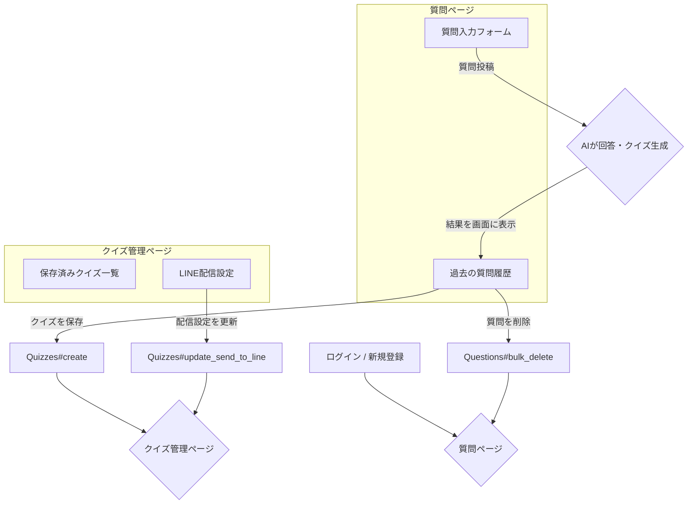

### 🧠 “学ぶ”を加速する、“知識”が定着する。

**AIと共に学ぶ、次世代のクイズ学習ツール。**

このアプリは、**質問を投稿するだけ**でAIが**要約・例え話・クイズ**を自動生成。  
さらに**LINEにクイズを届ける**ことで、日々のスキマ時間を活用した**効率的な知識の定着**をサポートします。

- 🤖 **Google Geminiによる高品質な要約・クイズ生成**
- 🧑‍🏫 **学習者レベルに応じた例え話の自動生成**
- 📱 **LINE連携によるクイズの自動配信**

これらの機能を通じて、  
「**インプットからアウトプットまで**」の学習サイクルを自動化し、**継続的なスキルアップ**を支援します。

---

## 🎯 制作背景

本アプリは、「効率的に知識を定着させ、日々の学習を習慣化できるツールを作りたい」という思いから制作しました。
新しいことを学ぶ際、情報をインプットするだけでなく、それを要約したり、問題を解いたりといったアウトプットのプロセスが知識の定着には不可欠です。しかし、忙しい毎日の中で、このアウトプットの作業まで手が回らないことも少なくありません。

また、学んだことを復習する習慣を身につけるのも難しい課題です。

そうした背景を踏まえ、**学習のインプットからアウトプット、そして復習までを半自動化できないか**と考えるようになりました。

そこで私は、**AIによる回答・クイズ生成機能と、LINEによる配信機能を備えたクイズ学習アプリ**を開発しました。  
知りたいことを質問するだけで、AIが構造化された回答と理解度を測るクイズを生成。生成したクイズはLINEに毎日届くため、**無理なく学習を習慣化し、知識とスキルの定着を加速させる**ことを目指しています。

---

## 🌐 アプリURL

🔗 [https://quiz-study-ibeu.onrender.com/](https://quiz-study-ibeu.onrender.com/)

## テスト用アカウント

- **mail** ： `test@example.com`
- **パスワード** ： `testtest`

---

## 📖 アプリの機能紹介

### 🔝 質問投稿・AI生成ページ

[](https://via.placeholder.com/800x400.png?text=質問投稿とAI生成結果)
*ユーザーが質問を投稿すると、即座にAIが回答・例え話・クイズを生成します。*

### 📚 質問履歴・クイズ保存ページ

[](https://via.placeholder.com/800x400.png?text=質問履歴ページ)
*過去の質問とAIが生成した回答・クイズの一覧。ここからクイズの保存や削除ができます。*

### 📱 LINEクイズ管理ページ

[](https://via.placeholder.com/800x400.png?text=LINEクイズ管理ページ)
*保存したクイズの中から、LINEに配信するクイズを管理できます。*

---

## ✍️ 各機能の詳細

### ❓ 質問の投稿

- **学習したい内容を自由な形式で質問可能**
- **抽象化レベルの指定**：AIが生成する例え話の難易度を「小学生向け」「中学生向け」のように調整できます。
- **例え話のジャンル指定**：例え話のテーマを「IT」「料理」「スポーツ」などから選択し、より身近な具体例で理解を深めることができます。

---

### 🤖 AIによる回答・クイズ生成

- **Googleの最新AI「Gemini」** を活用しています。
- **構造化された回答**：質問内容の要点をまとめた、分かりやすい回答を200文字以内で生成します。
- **パーソナライズされた例え話**：指定された抽象化レベルとジャンルに基づき、ユーザーの知識レベルに合わせた例え話を生成します。
- **三択クイズの自動生成**：回答内容の理解度を確認するための三択クイズと正解を自動で作成します。

---

### 💾 クイズの保存・管理

- AIが生成した質問・回答・クイズのセットは、**ボタン一つで保存可能**です。
- 保存したくない質問は、チェックボックスで**一括削除**できます。

---

### 📱 LINE連携とクイズ配信

このアプリケーションは、LINE通知の役割を分担するハイブリッド構成を採用しています。

- **定期的なクイズ配信 (by Google Apps Script)**
  - 保存したクイズの中から、LINEに配信したいものを管理画面で選択できます。
  - 選択されたクイズは、Google Apps Script (GAS) との連携により、毎日決まった時間にLINEへ自動でプッシュ通知されます。
  - GASのトリガー機能を利用することで、Railsサーバーに負荷をかけることなく安定した定期実行を実現しています。

- **リアルタイム通知 (by Rails)**
  - ユーザーのアカウント連携完了時など、アプリケーション内での出来事に即座に反応する必要がある通知は、Railsのバックグラウンド処理で実行されます。

---

## 🌟 工夫した点（UI/UX・内部実装）

このアプリは、学習のハードルを下げ、継続を促すための工夫を随所に凝らしています。

- **単一ページでの学習サイクル**：質問の投稿、AIによる生成、結果の確認、そして過去の履歴閲覧までを、ページ遷移を最小限に抑えた単一の画面で完結できるように設計しました。これにより、ユーザーは迷うことなく学習サイクルを回せます。
- **動的なプロンプト生成**：ユーザーが指定した「抽象化レベル」や「例え話のジャンル」を、Gemini APIに送るプロンプト（指示文）に動的に組み込んでいます。これにより、単なるAIの応答ではない、ユーザーのニーズに寄り添ったパーソナライズされた学習体験を提供します。
- **非同期処理での一括管理**：質問履歴の削除や、LINE配信設定の更新は、JavaScript（Stimulus）を用いて非同期で処理されます。ページをリロードすることなくスムーズに操作が完了するため、ストレスのないUXを実現しています。
- **サービス層の分離と外部サービス連携**: LINE通知機能を、定期実行はGoogle Apps Script、リアルタイム応答はRails、というように役割分担しています。このハイブリッド構成により、それぞれのプラットフォームの長所を活かし、責務を明確に分離しています。
- **環境変数による柔軟な設定**：APIキーや認証情報などを環境変数で管理することで、開発環境と本番環境で異なる設定を安全かつ柔軟に切り替えられるようにしています。

---

## 🏗️ 主な使用技術

- 💎 **言語**: Ruby 3.2.0
- 📜 **言語**: JavaScript
- 🧰 **フレームワーク**: Ruby on Rails 7.1.5
- 🔐 **認証**: Devise
- 🗄️ **データベース**: MySQL（開発） / PostgreSQL（本番）
- 🤖 **AI**: Google Vertex AI (Gemini 1.5 Flash)
- 📱 **外部連携**: LINE Messaging API, Google Apps Script
- 🎨 **CSS/UI**: Bootstrap 5, SASS
- 🚀 **デプロイ環境**: Render
- ✅ **テスト**: RSpec
- 🗂️ **バージョン管理**: GitHub

---

## 📦 モデル構成と概要

### 👤 User（ユーザー）

- Deviseで管理されるアカウント
- 各種データの所有者
```
has_many :questions
has_many :quizzes
has_many :answers
```

| カラム名 | 型 | Options |
| --- | --- | --- |
| email | string | null: false, unique |
| encrypted\_password | string | null: false |
| line\_uid | string | LINEユーザーID |

---

### ❓ Question（質問）

- ユーザーが投稿した質問と、AIが生成したコンテンツを保持

| カラム名 | 型 | Options |
| --- | --- | --- |
| content | text | null: false |
| answer\_text | text | AIが生成した回答 |
| analogy\_text | text | AIが生成した例え話 |
| quiz\_question | text | AIが生成したクイズ問題 |
| quiz\_choices | text | AIが生成したクイズ選択肢 |
| quiz\_answer | string | AIが生成したクイズの正解 |
| abstraction\_level | string | 例え話の抽象度 |
| analogy\_genre | string | 例え話のジャンル |
| user\_id | reference | null: false, FK |

```
belongs_to :user
has_one :quiz
```

---

### 📝 Quiz（クイズ）

- ユーザーが保存を選択したクイズを管理

| カラム名 | 型 | Options |
| --- | --- | --- |
| quiz\_text | text | クイズ問題 |
| quiz\_choices | text | クイズ選択肢 |
| quiz\_link | string | 復習用リンク |
| send\_to\_line | boolean | LINE配信フラグ |
| user\_id | reference | null: false, FK |
| question\_id | reference | null: false, FK |

```
belongs_to :user
belongs_to :question
has_many :answers
```

---

### ✅ Answer（回答履歴）

- ユーザーがクイズに回答した履歴（将来的な機能拡張用）

| カラム名 | 型 | Options |
| --- | --- | --- |
| content | text | ユーザーの回答内容 |
| user\_id | reference | null: false, FK |
| quiz\_id | reference | null: false, FK |

```
belongs_to :user
belongs_to :quiz
```

---

## 🗂️ ER図

[](https://via.placeholder.com/800x400.png?text=ER図をここに配置)

---

## 🧭 画面遷移図



## 🚀 今後の実装予定

### 📈 学習状況の可視化

- クイズの正解・不正解を記録する機能を追加
- カテゴリごとの正答率などをグラフで表示し、苦手分野を可視化できるようにします。

### 🛡️ セキュリティ・利便性の強化

- **ソーシャルログイン（Googleなど）の対応**
- パスワードレスな選択肢を取り入れ、利便性と安全性の両立を図ります。

### 📱 モバイル対応の強化（レスポンシブデザイン）

外出先でも快適に使えるよう、スマートフォンでの表示最適化をさらに進めていきます。

---

## 制作者

- (T.S)

